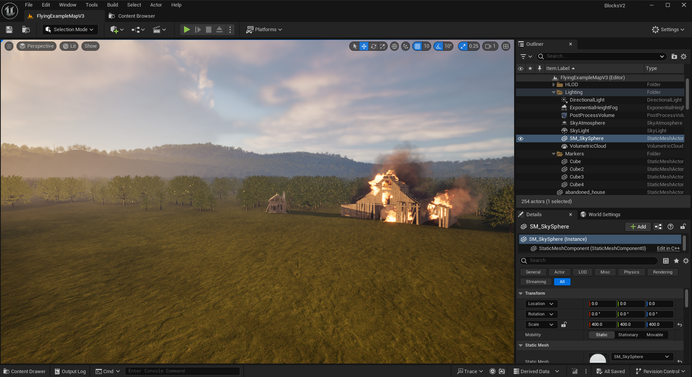
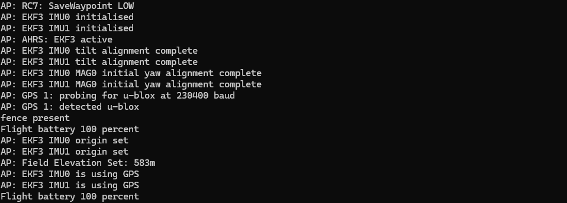

# Drone Swarm Simulation Airsim and Gazebo (WIP)

Before testing drone control scripts or GCS (ground control station) commands in the field with real - and expensive - drones, it is possible to test in simulated environments with virtual ones first. The goal of this guide is to create scripts and techniques in a safe, virtual, and easily replicable environment - with a focus on transferability to the real world with actual drones. To that end, this guide will demonstrate the following the process:
* Setting up a simulated environment and drone controller.
* Creating simple control scripts.
* Adding multiple drones to a single environemnt.
* Accessing cameras and video streams for machine vision tasks.

This guide was created as part of a Summer 2025 Engineering Undergraduate Research Fellowship at the University of Kentucky at the Secure Decentralized Systems Laboratory under the supervision of Dr. Yang Xiao.

> This repository is in development with additional code and documentation planned. Some planned additions:
> * ~~Multi-drone simulations using Airsim to afford easier environment creation.~~
> * ~~Additional coding scripts to better incorporate classification/object detection.~~
> * Rewriting scripts using MAVSDK (C++) and Pymavlink (Python) due to limited Dronekit support.
> * ~~Encorporating a custom networking model for better efficiency.~~

## Pre-requisites
* Minimum specifications for Gazebo-Harmonic or Unreal Engine 5.4.
* Ubuntu 22.04 or Windows with WSL2 (with Ubuntu installed).

### Note:

It is worth pointing out that this guide and project has been developed with very specific requirements and for particular applications:
* Maximum transferability to real drones.
* Disaster scenario classification and consensus.
* Capable of running on Raspberry Pi's.
> This guide specifically uses quadcopter drone models, but other vehicle types can be set up in a similar way.

There are built-in ways to get a drone swarm up and running in either Gazebo or Airsim, which are well-documented. This project builds on top of these frameworks to accomplish the specific requirements listed above, but there may be simpler, or better, ways for you to get your swarm working using Gazebo or Airsim, at least if you don't have similar requirements as listed above. Regardless, I hope you can find something useful in this project.

# Simulators
The first step is to choose your simulated environment - Gazebo or Unreal Engine with Airsim (this guide uses the Colesseum fork) - both of which are overviewed below.

## Gazebo
Gazebo is a popular robotics simulator. It allows for the simulation of detailed vehicles, drones, and robots. These simulations include physics, sensors and cameras, and even the individual components and motors of your vehicles. Gazebo offers a more in-depth simulation, but has a harder environment creation process compared to Airsim as Unreal Engine has a lot of convenient tools to create environments - it is a game engine after all. That being said, Gazebo is significantly less graphically demanding, so it remains a solid option.

  

> Gazebo image [source](https://gazebosim.org/showcase)

### Pros:
* Simple to set up a basic swarm.
* Significantly less resource-intensive than Unreal Engine.
* Advanced customization, deep simulation, and configuration possibilities.
* ROS integration.

### Cons:
* More advanced environments are difficult to create, typically created using CAD software.
* Multi-drone configuration is somewhat complicated - at least how I accomplished it.

## Airsim (Colesseum Fork)
Airsim is a plugin made for Unreal Engine 4 and developed by Microsoft. Development was halted after 2020, but several forks of the project are still maintained. The fork I have chosen is called Colosseum and is maintained by CodexLabsLLC. The Colleseum fork has been updated to use Unreal Engine 5.4.

  

  

### Pros:
* Friendlier interface for basic tasks.
* Very easy to set up multiple drones.
* Unreal Engine affords useful development tools for creating environments.
* Large asset library.
* Better visual fidelity.
* Detailed guides and videos.

### Cons:
* Much more GPU-intensive than Gazebo.
* Simulations are less realistic and customizable.
* Unreal Engine is very complicated to learn beyond basic functionality.

This project has shifted to using Airsim from Gazebo due to the environment creation tools as disaster classification is a focus. The guides and code for Gazebo will remain, but will likely not be updated in the future.

## Other tools we need:

### SITL
Regardless of your choice of simulator, we will need some other components. Ardupilot's SITL is a tool that allows us to simulate the inner workings of the drone itself: the controller. Sensor data such as GPS location, various status and safety checks, battery level, and more are simulated. This allows us to use real-world methods (e.g. [Mavlink messages](https://mavlink.io/en/)) to control the drone - this is very compatible with custom drone builds using PixHawk controllers, for example. If you are using a proprietary drone, they likely have their own custom libraries that you will want to use for controlling them.

  

> SITL image [source](https://ardupilot.org/dev/docs/sitl-simulator-software-in-the-loop.html)

### Mavproxy
Mavproxy is a command line GCS affording us simple commands, connection forwarding, and other utilities - such as a satellite map. It is automatically started with the simulated drone controller. Mavproxy is a powerful tool and the default interface Ardupilot's SITL uses to connect to the drone. We will mostly be using it for simple testing and connection forwarding (i.e. as the bridge between the simulation and our code).

  

## Guide Layout
There are two main folders in this repository: `code` and `guides`. 

The `code` folder contains... code that you can use to test functionality or use as a reference to get you own simulation up and running. Within that folder, there are two subfolders: `airsim` and `gazebo`. The scripts that exclusively control drone movements are identical across the two folders, but those involving the drone cameras or machine vision tasks are not. For example, accessing the drone cameras in Airsim requires the use of the Airsim API, while Gazebo uses Gsteamer.

The `guides` folder is set up in a similar way: one for Airsim, another for Gazebo. Within either Airsim or Gazebo, there are three guides: setup, camera setup, and how to create a drone swarm. They cover the initial setup and installation process, how to access the camera feeds, and how to set up multiple drones in your environment, respectively.

